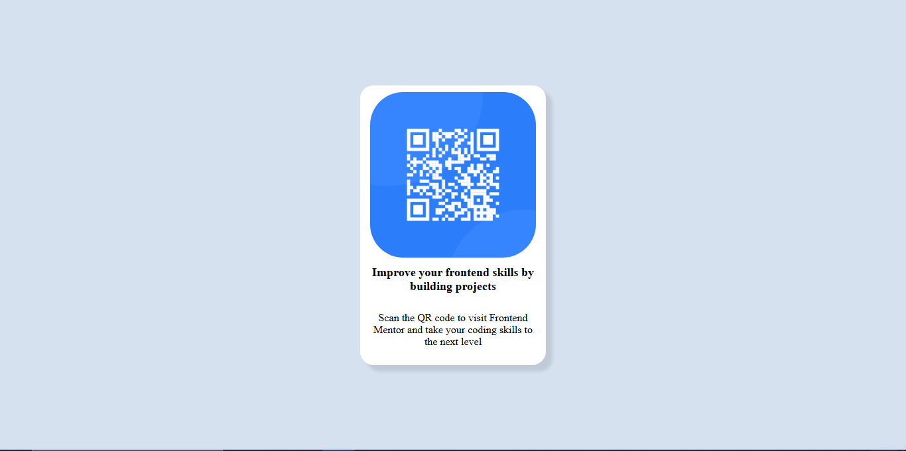

# Frontend Mentor - QR code component solution

This is a solution to the [QR code component challenge on Frontend Mentor](https://www.frontendmentor.io/challenges/qr-code-component-iux_sIO_H). Frontend Mentor chanllenges helps you to improve your coding skills by building realistic projects.

## Table of contents

- [Overview](#overview)
- [Screenshot](#screenshot)
- [Links](#links)
- [My process](#my-process)
- [Built with](#built-with)
- [What I learned](#what-i-learned)
- [Continued development](#continued-development)
- [Useful resources](#useful-resources)
- [Author](#author)
- [Acknowledgments](#acknowledgments)

## Overview
This project is a responsive web application built as part of the Frontend Masters coding challenge. The goal was to practice working with mostly resposive design, position, resposive web layouts and the use of modern dev tools.

### Screenshot 

 

### links
- Github  URL:(https://github.com/ejike-allwell/dev.git)
- Live Site URL:(https://dev-rouge-ten.vercel.app/)

## My process 
I created a different folder for this solution. Inside this folder i initialized a git repositiory, created a HTML, and CSS files, and i staged and commit these newly created files.

I continued by marking out my basic website structure that has the image, the header and the paragraph all in inside a div container, and staged and commited these modifications.

After the successfull creation and basic structuring, i proceeded to first making styles for mobile and staged and commited these changes, then making styles for desktop view and staged and commited these procedures.

### Built with

- Semantic HTML5 markup
- CSS custom properties
- Flexbox
- CSS Grid
- Vscode
- Mobile preview(an extension in vs code)

## What i learned 

I learned how to make a webpage resposive with the use of media queries, grid-display, transformation and positioning. 

## Continued development 

I would love to continue learning about responsive web design(RWD) and more importantly also learn about positioning and transformatons.

## Author 

-Frontend Mentor - [@ejike-allwell](https://www.frontendmentor.io/profile/ejike-allwell)
-Twitter - [@ejike897067](https://x.com/ejike897067)

## Acknowledgments

The one tip i want to share, is to always read the brief, preview or even reviews. It will save you quite a huge amount of stress and i speaking out of experience